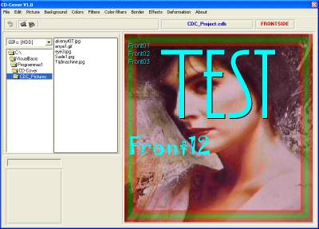



## CD\-Cover

### Description

Complete program to make covers for CD-Roms. A small envelope you might say. Print the result on a sheet of at least 200gr - heavy paper. The working of the program: find it out yourself. This prg works perfectly, so I don't want to hear things like "it doesn't work" and other sh!t. Full of API also. The graphic routines are very fast. Enjoy. Found a bug ? Email me !
 
### More Info
 

             |
---                |---
**Submitted On**   |2003-12-09 06:27:52
**By**             |[stephane swertvaegher](https://github.com/Planet-Source-Code/PSCIndex/blob/master/ByAuthor/stephane-swertvaegher.md)
**Level**          |Advanced
**User Rating**    |5.0 (20 globes from 4 users)
**Compatibility**  |VB 6\.0
**Category**       |[Custom Controls/ Forms/  Menus](https://github.com/Planet-Source-Code/PSCIndex/blob/master/ByCategory/custom-controls-forms-menus__1-4.md)
**World**          |[Visual Basic](https://github.com/Planet-Source-Code/PSCIndex/blob/master/ByWorld/visual-basic.md)
**Archive File**   |[CD\-Cover16823112102003\.zip](https://github.com/Planet-Source-Code/stephane-swertvaegher-cd-cover__1-50398/archive/master.zip)

